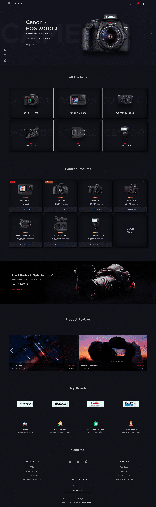

## CameraX - Camera Store - ECOM Website

### [Demo Link](https://camerax.netlify.app/) 🔗

A modern & retina-friendly eCommerce website built with the aim to engage user experience. It features an elegant & stylish design with a 3D Product Slider, Cart page, & much more.
 

## Features:

- #### **Fully Responsive 💯**
- #### **Multi Page 📰**
- #### **Dark Theme 🎨**
- #### **Cross platform ✅**
 

## Technologies used:

- #### **HTML**
- #### **CSS**
- #### **Bootstrap-5**
- #### **jQuery**
 

## Author:

- **Gulshan Songara** - **[Portfolio Website](https://gulshansongara.netlify.app)**, **[Linkedin](https://www.linkedin.com/in/gulshansongara/)** 
 

## License:

This project is licensed under the  **GPL-3.0** License - see the [LICENSE](LICENSE) file for details.
